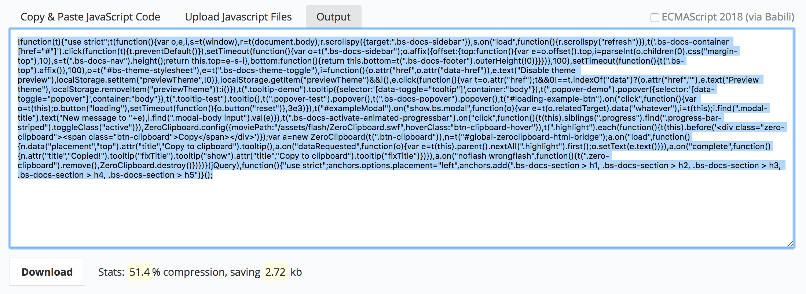

# Audit
In this document I will tell abit about compression and how much it
affects the performance. :smile:  
De master branch is het gene waar ik niks heb aangepast.  
Bij de javascript branch zit ook de image en css compression.  

## Image compression
De image compression safes 50% of the total image size :thinking:

## Css compression
Css compression was almost 25% compressed the css. :thinking:

## Js compression
Js compression saves 51% :thinking:

## Testing the site on 200kb.
Why do I test it on 200kb? I can clearly see what takes a long time to load.
When u know this u can take the next steps to give the user a nice experience.  

Uncompressed loading speed
  

Compressed loading speed 10s. :open_mouth:

## Conclusion.
After deployment make sure you can compress your files for beter :fire:performance:fire:
