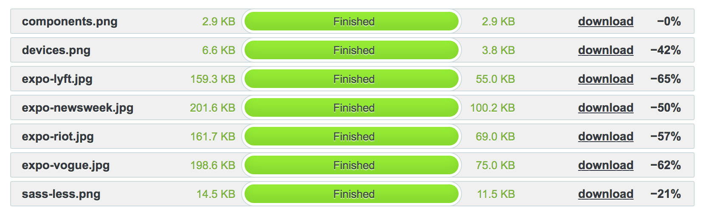

# Image-compression
I always ask myself to take a look at the compression of   images, is this a frontender's job or the designers job?   :thinking:  

After compressing the images it works a lot faster.  
I used [Tinypng](tinypng.com)

## Compression saving
Thanks to the :panda: I saved 57%.

