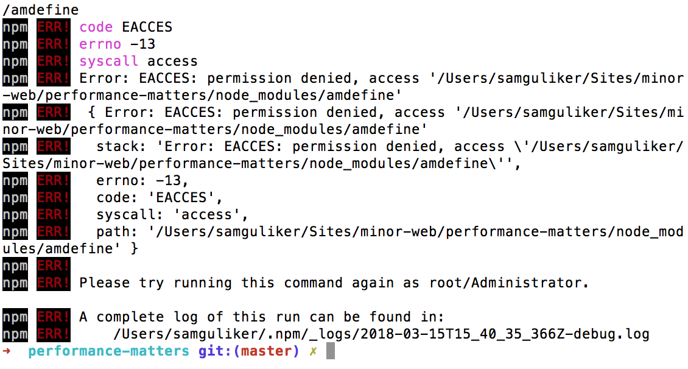

## Project setup

This project serves an adapted version of the [Bootstrap documentation website](http://getbootstrap.com/). It is based on the [github pages branche of Bootstrap](https://github.com/twbs/bootstrap/tree/gh-pages).

Differences from actual Bootstrap documentation:

- Added custom webfont
- Removed third party scripts
- The src directory is served with [Express](https://expressjs.com/).
- Templating is done with [Nunjucks](https://mozilla.github.io/nunjucks/)

## Getting started
- Install dependencies: `npm install`
- Serve: `npm start`
- Expose localhost: `npm run expose`

# Audit
In this document I will tell abit about compression and how much it
affects the performance. :smile:  
De master branch is het gene waar ik niks heb aangepast.  
Bij de javascript branch zit ook de image en css compression.  

## How will I start?
How am I going to to do this? :thinking:

* Compressing the css files.
* Compressing the JS files.
* Compressing images.
* Loading fonts async.  

I've made some branches which contain the the subjects of the list above.

I unfortunately have errors with my node modules.

## Image compression
De image compression safes 50% of the total image size :thinking:

## Css compression
Css compression was almost 25% compressed the css. :thinking:

## Conclusion.
After deployment make sure you can compress your files for beter :fire:performance:fire:
