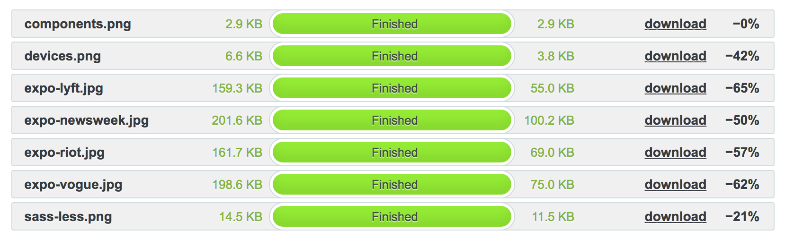

# Css compression
Css compression by [csscompressor](https://csscompressor.com/)
The files I compressed.  
These files are small, I can imagen that when you have big   project you can save a looottt for a beter performance.

bootstrap.css
docs.css  

## Bootstrap
Bootstrap compression saved 25%  
  

## Docs
Docs compression saved 54.16%  
  

# Loading font.
A part of critical css.

## Loading the custom font later.
With this piece of code it will be will focus on the  html rendering. When its done it will add a class to render  
the font.  

```

  var font = new fontfaceobserver('source_sans_pro')
  var html = document.documentElement

  font.load().then(function(){
    html.className += 'fonts-loaded'
  })

```

## Js compression
Js compression saves 51% :thinking:
  

The javascript compression saved a little bit of performance

# Image-compression
I always ask myself to take a look at the compression of   images, is this a frontender's job or the designers job?   :thinking:  

After compressing the images it works a lot faster.  
I used [Tinypng](tinypng.com)


## Compression saving
Thanks to the :panda_face: I saved 57%.

